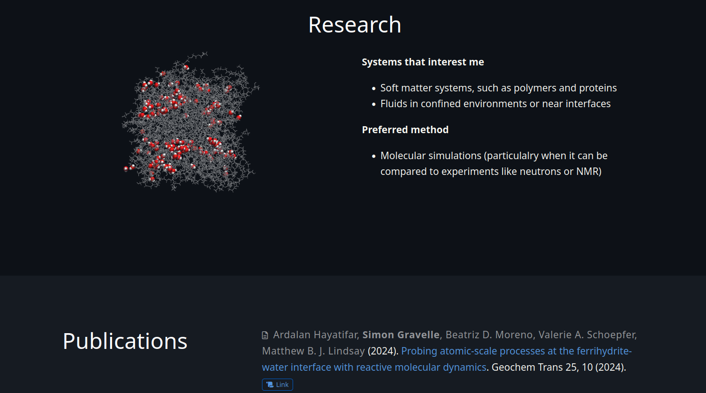

[](https://www.gnu.org/licenses/gpl-3.0)


# Academic template

A simple academic template that is easy to deploy on GitHub page, and relatively
easy to customize using css. You can find the [live](https://simongravelle.github.io/)
version, and my resume [here](https://simongravelle.github.io/files/resume/resume-simon-gravelle.pdf).

## Automatic update of the publication list

The list of publications is updated automatically from Google Scholar using
the [scholar-collector](https://github.com/simongravelle/scholar-collector).

## Overview

[](https://simongravelle.github.io/)

[](https://simongravelle.github.io/)

## Credit

This template was originally taken from [wowchemy](https://wowchemy.com/), with
some custom CSS adapted from [nickballousite](https://github.com/nballou) webpage.

## How to build locally

To build locally on your computer, type:

```bash
hugo server
```

## How to modify

After cloning this repository, you can adapt it by:

- add your own content in the [content](content/) folder,
- custom css script can be written in [assets/scss/custom.scss](assets/scss/custom.scss),
- each publication can be entered as a folder in [content/publication/](content/publication/).

## How to deploy

In Settings, Pages, select:
- Deploy from a branch as Source
- gh-pages, `/(root)` as Branch
